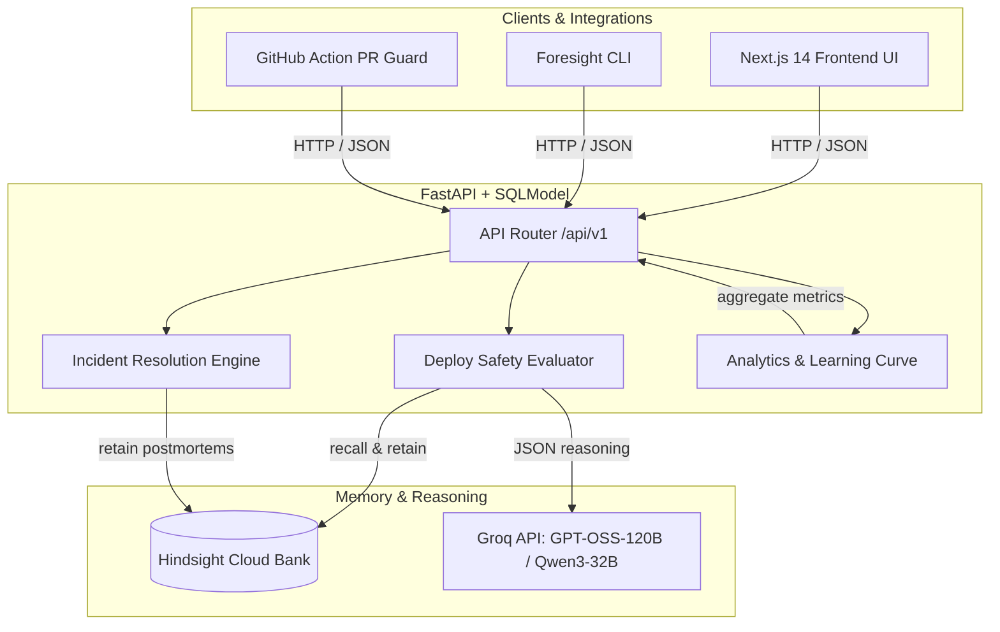

# Foresight 🛡️

**Tagline:** *Hindsight remembers. Foresight prevents.*

Foresight is an AI deploy-safety agent designed for fintech and payments engineering teams. Before a high-risk change ships to production, Foresight analyzes the pull request or configuration diff against the team's entire incident postmortem and deploy history kept in **Hindsight memory**.

It answers the ultimate question: **"Should we ship this, and if not, why?"** When outages do occur, Foresight recalls what fixed similar incidents, what failed, and which quick fixes only held temporarily.

---

## 1. Problem & Value Proposition

Without memory, AI code reviewers yield generic, unhelpful advice like *"add unit tests and use a canary deployment."*

With **Hindsight memory**, Foresight speaks with surgical context:
> *"You changed the payment retry timeout from 30s to 8s. The same class of change caused SEV-1 double-debit outages on Aug 12 and Sep 3. Rollback fixed it in 38 minutes, but config drift brought back the issue 9 days later. Ship ONLY with a canary and mandatory idempotency-key header enforcement."*

---

## 2. Architecture Diagram



---

## 3. How Hindsight Memory is Used

Hindsight is the core engine of Foresight. Each organization operates a dedicated Hindsight memory bank (e.g. `foresight-paynest`).

### Core Hindsight SDK Calls

1. **`retain` (Ingesting Incidents & Outcomes):**
   ```python
   hindsight.retain(
       bank_id="foresight-paynest",
       content="[INC-2024-001] Gateway timeout reduction from 30s to 8s caused downstream retry storm and double debits...",
       document_id="INC-2024-001",
       tags=["payments-gateway", "SEV-1", "retry_storm"],
       metadata={"service": "payments-gateway", "root_cause": "retry_storm"}
   )
   ```

2. **`recall` (Retrieving Historical Precedents):**
   ```python
   memories = hindsight.recall(
       bank_id="foresight-paynest",
       query="payments-gateway retry timeout GATEWAY_RETRY_TIMEOUT_MS=8000",
       tags=["payments-gateway"]
   )
   ```

3. **`reflect` (Synthesizing Risk Briefs):**
   Synthesizes cautious, evidence-driven verdicts backed by recalled incident documents and temporary fix durations.

### Before & After Comparison: Memory OFF vs Memory ON

| Feature | Memory OFF (Generic LLM) | Memory ON (Hindsight + LLM) |
| --- | --- | --- |
| **Verdict** | `CANARY` (Risk Score: 45/100) | `HOLD` (Risk Score: 87/100) |
| **Summary** | "Retry timeout was reduced. Ensure upstream service can handle faster retries." | **CRITICAL RISK:** Lowering gateway retry timeout to 8s matches identical changes that caused SEV-1 double-debit outages on Aug 12 and Sep 3. |
| **Past Precedents** | None cited (0 citations). | Cited **INC-2024-001** & **INC-2024-002** with similarity reasons, failed fixes, and working fixes. |
| **Actionable Guidance** | "Run standard unit tests." | "Rollback timeout to >=25s, enforce client-side idempotency keys, and deploy only via canary." |

---

## 4. Quickstart & Local Setup

### Prerequisites
- Python 3.11+
- Node.js 18+ & npm

### Environment Variables
Copy `.env.example` to `.env`:
```bash
FORESIGHT_MODE=offline            # 'offline' (deterministic mock) or 'live'
API_KEY=foresight-secret-key-123  # Master API key
GROQ_API_KEY=                     # Groq API key for live mode
HINDSIGHT_API_KEY=                # Hindsight Cloud API key for live mode
HINDSIGHT_BANK_ID=foresight-paynest
```

### 1. Backend Setup
```bash
# Install dependencies in editable mode
pip install -e ".[dev]"

# Start FastAPI server
uvicorn backend.app.main:app --reload --port 8000
```
API docs available at `http://localhost:8000/docs`.

### 2. Frontend Setup
```bash
cd frontend
npm install
npm run dev
```
Access UI at `http://localhost:3000`.

### 3. CLI Setup
```bash
pip install -e cli/

# Run CLI check
foresight check \
  --service payments-gateway \
  --title "Lower gateway retry timeout from 30s to 8s" \
  --diff ./change.diff
```

---

## 5. 90-Second Demo Script

1. **Reset & Seed State:** Open `/demo` page or click **"Run Demo Replay"** to seed 20 PayNest incidents and 40 past deploys into memory.
2. **Run Friday 5:40 PM Check:** Navigate to `/check`. Select example *"Friday 5:40 PM: Gateway Retry Timeout Reduction"* and click **"Run Safety Check"**.
3. **Observe Cited HOLD Verdict:** See Risk Score 87/100, `HOLD` badge, and cited past double-debit incidents (INC-2024-001, INC-2024-002).
4. **Toggle Memory OFF:** Click the top **"Memory ON"** toggle to switch to **"Memory OFF"** and click **"Re-run Check"**. Watch the verdict drop to a generic response without citations.
5. **Ask Foresight:** Go to `/ask` and click the prompt chip *"What broke last time we changed retry timeouts?"* to view real-time streaming answer with Hindsight citations.
6. **Review Insights:** Visit `/insights` to inspect the learning curve showing risk accuracy climbing over time as memory grows.

---

## 6. Docker & Deployment

### Running via Docker Compose
```bash
docker-compose up --build
```
- Frontend: `http://localhost:3000`
- Backend: `http://localhost:8000`

### Vercel Deployment (Frontend)
1. Import `frontend/` directory into Vercel.
2. Set Environment Variable: `NEXT_PUBLIC_API_BASE_URL=https://your-backend.onrender.com`.
3. Deploy.

### Render / Railway Deployment (Backend)
1. Create new Web Service from repository with Docker runtime pointing to `backend/Dockerfile`.
2. Set environment variables (`FORESIGHT_MODE`, `GROQ_API_KEY`, `HINDSIGHT_API_KEY`).
3. Deploy.

---

## 7. License & Synthetic Data Disclaimer

All data in `data/seed/` is synthetic and pattern-based, inspired by real public incident postmortems adapted into the fictional PayNest payments platform.
