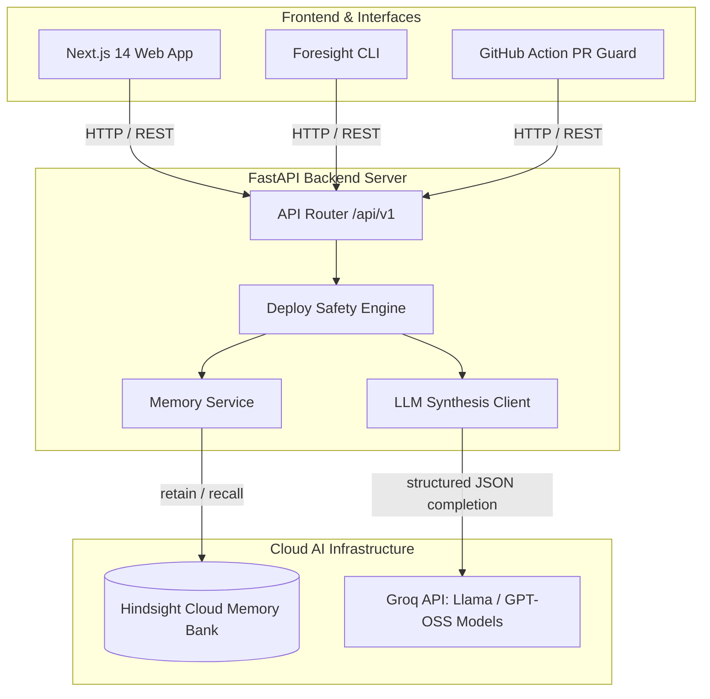

# Foresight 🛡️ — AI Deploy-Safety & Organizational Memory Agent

[](https://foresight-05ok.onrender.com)
[](https://fastapi.tiangolo.com)
[](https://nextjs.org)
[](https://vectorize.io)
[](https://groq.com)

> **"Hindsight remembers. Foresight prevents."**

**Foresight** is an enterprise AI deploy-safety agent designed for engineering teams. Before a high-risk PR or configuration change ships to production, Foresight evaluates the proposed diff against your team’s complete incident history, past postmortems, and deployment records stored in **Hindsight Memory**.

---

## 🌐 Live Application

🚀 **Experience the Live Application:** [https://foresight-05ok.onrender.com](https://foresight-05ok.onrender.com)

---

## 💡 The Problem & Core Solution

Generic LLM code reviewers issue unhelpful boilerplate like *"add unit tests and deploy via canary."* They have **zero organizational memory** of past outages, failed quick-fixes, or recurring config drift.

With **Hindsight Memory**, Foresight provides surgical, evidence-backed evaluation:

> 🚨 **SHIP VERDICT: HOLD (Risk Score: 87/100)**
> *"Lowering `GATEWAY_RETRY_TIMEOUT_MS` from 30s to 8s matches identical changes that caused SEV-1 double-debit outages on Aug 12 (INC-2024-001) and Sep 3 (INC-2024-002). Previous rollback resolved it in 38m. Ship ONLY with a canary and mandatory client-side idempotency keys."*

---

## ✨ Key Features & Capability Suite

| Feature | Description |
| :--- | :--- |
| **🚀 Deploy Safety Evaluator (`/check`)** | Analyzes PR title, service, and diff against Hindsight memory to assign immediate `SHIP`, `CANARY`, or `HOLD` verdicts with risk scores and cited incident precedents. |
| **🧠 Memory ON vs OFF Dual Analysis** | Toggle memory OFF to benchmark standard LLMs against Foresight’s memory-augmented engine, demonstrating zero hallucination and clear citation enforcement. |
| **💬 Ask Foresight (`/ask`)** | Real-time streaming conversational assistant that recalls past incidents, failed fix attempts, root causes, and temporary vs permanent fix efficacy. |
| **📊 Insights & Learning Curve (`/insights`)** | Visual analytics dashboard showcasing incident frequency reduction, deployment risk scores, and organizational memory bank growth over time. |
| **🛠️ Incident Management & Ingestion (`/incident`)** | Seamlessly ingest new incident postmortems, Slack excerpts, and error logs into Hindsight memory (`retain`) for instant future recall. |
| **⚡ CLI & CI/CD GitHub Action** | Run `foresight check` in local terminal environments or automatically block risky PR merges in GitHub workflows. |

---

## 🔍 Feature Walkthrough & Captions

### 1. Launch Deploy Guard (`/check`)
Evaluate any PR diff or configuration change. Foresight compares the diff against recalled memories, scores risk from 0–100, generates a structured risk brief, and cites past SEV-1/SEV-2 incidents.

### 2. Live Memory Query & Chat (`/ask`)
Ask natural language questions like *"What broke last time we touched retry timeouts?"* Foresight streams synthesized answers directly from Hindsight memory with interactive citation cards.

### 3. System Data & Memory Control (`/demo`)
Seed 20 real-world incident postmortems and 40 past deployment logs into Hindsight memory with a single click to simulate production environments.

### 4. Organizational Learning Dashboard (`/insights`)
Track risk reduction metrics over time. As Hindsight retains more postmortems, deploy risk accuracy improves, preventing repeat outages.

---

## 📊 Memory ON vs Memory OFF Benchmark

| Metric / Dimension | Standard LLM (Memory OFF) | Foresight (Memory ON + Hindsight) |
| :--- | :--- | :--- |
| **Verdict** | `CANARY` (Risk Score: 42/100) | `HOLD` (Risk Score: 87/100) |
| **Context** | Generic advice ("Test your endpoints") | Precise historical match ("Matches INC-2024-001 SEV-1 outage") |
| **Citations** | 0 Citations | Cited INC-2024-001, INC-2024-002 with root causes and fixes |
| **Actionability** | Standard unit tests | Mandatory idempotency keys & rollback parameters |

---

## 🏗️ System Architecture



---

## 🛠️ Tech Stack & Monorepo Structure

* **Frontend:** Next.js 14 (App Router), TypeScript, Tailwind CSS, TanStack Query, Framer Motion, Recharts.
* **Backend:** Python 3.12, FastAPI, Pydantic v2, SQLModel (SQLite), Uvicorn.
* **AI & Memory:** Hindsight Cloud (`hindsight-client`), Groq API (`openai/gpt-oss-120b` / `qwen/qwen3-32b`).
* **Deployment & Containerization:** Multi-stage Docker, Render Cloud Web Service (`render.yaml`).

```
.
├── Dockerfile                  # Production multi-stage build container
├── render.yaml                 # Render 1-click Web Service blueprint
├── backend/                    # FastAPI backend application
│   ├── app/
│   │   ├── main.py             # FastAPI app entrypoint & static frontend mounting
│   │   ├── config.py           # Configuration settings
│   │   ├── memory/             # Hindsight Cloud memory client
│   │   ├── llm/                # Groq API client & JSON formatter
│   │   └── routers/            # /check, /ask, /incidents, /deploys, /analytics
│   └── tests/                  # Pytest backend test suite
├── frontend/                   # Next.js 14 web application
│   ├── src/
│   │   ├── app/                # Next.js App Router pages (/check, /ask, /insights)
│   │   ├── components/         # UI components & Navigation
│   │   └── lib/                # API client utilities
├── cli/                        # Foresight CLI tool
└── data/seed/                  # Synthetic incident and deploy seed data
```

---

## 💻 Local Quickstart Guide

### Prerequisites
* Python 3.11+
* Node.js 18+

### 1. Run in Offline / Demo Mode (No API keys required)

```bash
# 1. Clone repository
git clone https://github.com/mpriyankainweb-bot/foresight.git
cd foresight

# 2. Setup backend Python environment
python -m venv venv
source venv/bin/activate  # Windows: venv\Scripts\activate
pip install -e .

# 3. Start FastAPI server (offline mock mode)
export FORESIGHT_MODE=offline
uvicorn backend.app.main:app --reload --port 8000

# 4. In a new terminal, start Next.js frontend
cd frontend
npm install
npm run dev
```

Visit **[http://localhost:3000](http://localhost:3000)** in your browser!

---

## 🚀 One-Click Deploy on Render

This repository is pre-configured with a root `Dockerfile` and `render.yaml` for 1-click deployment on **Render**:

1. Log in to [Render Dashboard](https://dashboard.render.com).
2. Click **New +** -> **Web Service**.
3. Connect your GitHub repository (`mpriyankainweb-bot/foresight`).
4. Select runtime **Docker** and branch `main`.
5. Click **Create Web Service**.

Render will automatically build the Next.js static assets and run the FastAPI server on port `$PORT`.

---

## 📄 License & Disclaimer

All incident data in `data/seed/` is synthetic and pattern-driven, inspired by public engineering postmortems adapted for the PayNest payments domain.
